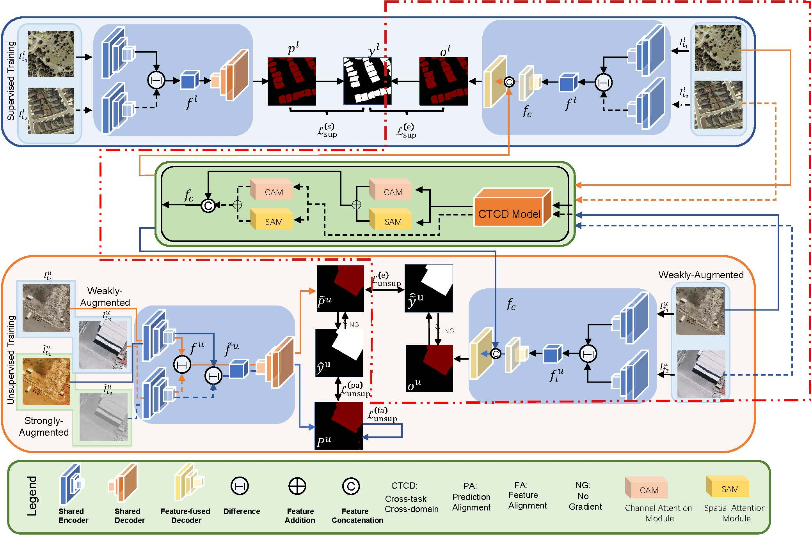

# C<sup>2</sup>F<sup>2</sup>:Cross-Task Cross-Domain Feature Fusion for Semi-Supervised Change Detection

This is the code of D. Zhang , “C<sup>2</sup>F<sup>2</sup>:Cross-Task Cross-Domain Feature Fusion for Semi-Supervised Change Detection” IEEE Transactions on Geoscience and Remote Sensing Letters.

## Introduction
In this study, we propose to enhance traditional semi-supervised learning frameworks by leveraging cross-task cross-domain (CTCD) models, which generate complementary features that differ from standard hidden features. The procedure is as follows. Firstly, the standard features obtained from a traditional encoding-decoding structure are fused with attention-augmented complementary features. Secondly, a secondary decoder maps the fused heterogeneous features into the label space to obtain high-quality pseudo-labels, offering more precise guidance for semi-supervised learning on traditional structures. This approach improves pseudo-labels by leveraging the strength of CTCD models, including large pre-trained models, to enhance the semi-supervised learning process of domain-specific and task-specific models. Experimental results on benchmark datasets demonstrate that our proposed approach surpasses state-of-the-art methods.


---

## Requirements

```
git clone https://github.com/Undefinedx-Zhang/CCFF.git

pip install -r requirements.txt
```

---

## Preparing

Please download the following ".pth" files :

["3x3resnet50-imagenet.pth"](https://github.com/yassouali/CCT/releases/download/v0.1/3x3resnet50-imagenet.pth") to the folder "CCFF/models/backbone/pretrained". 

["resnet101-63fe2227.pth"](https://download.pytorch.org/models/resnet101-63fe2227.pth) to the "CCFF/CTCD/backbone/pretrained". 

CTCD pre-training weight can be trained by yourself from [the repo](https://github.com/xiaoqiang-lu/LSST) or directly downloaded from [here](https://pan.baidu.com/s/15k_c4KtkgSrCAi0U4LsnXA) (code:7721).

Additionally, optimal parameters for our model can be downloaded [here](https://pan.baidu.com/s/15k_c4KtkgSrCAi0U4LsnXA) (code:7721).


---
## Datasets

The processed LEVIR-CD dataset, and supervised-unsupervised splits can be downloaded [`here`](https://www.dropbox.com/s/18fb5jo0npu5evm/LEVIR-CD256.zip?dl=0)

The processed WHU-CD dataset, and supervised-unsupervised splits can be downloaded [`here`](https://www.dropbox.com/s/r76a00jcxp5d3hl/WHU-CD-256.zip?dl=0)

to the folder "CCFF/datasets".

---

## Training 

Then simply run:
```
python train.py --config configs/config_LEVIR.json
```
 
The following table summarizes the **required changes** in ``config`` file to train a model with different percentage of labeled data. 

| Setting | Required changes|
| --- | --- |
| Semi-upervised - 5% labeled data | sup_percent= `5`|
| Semi-upervised - 10% labeled data | sup_percent= `10`|
| Semi-upervised - 20% labeled data | sup_percent= `20`|
| Semi-upervised - 40% labeled data | sup_percent= `40`|

---

## Citation

If you find this repo useful for your research, please consider citing the paper as follows:

```
@ARTICLE{10693550,
  author={Zhang, Dongjie and Hong, Yuting and Qiu, Xiaojie and Dong, Li and Yan, Diqun and Peng, Chengbin},
  journal={IEEE Geoscience and Remote Sensing Letters}, 
  title={C2F2: Cross-Task Cross-Domain Feature Fusion for Semi-Supervised Change Detection}, 
  year={2024},
  volume={},
  number={},
  pages={1-1},
  keywords={Standards;Feature extraction;Decoding;Training;Accuracy;Semisupervised learning;Supervised learning;change detection;remote sensing;semi-supervised learning;cross-task cross-domain models},
  doi={10.1109/LGRS.2024.3467260}}
  
```
---

## Acknowledgements

This code is based on [https://github.com/zxt9/FPA-SSCD](https://github.com/zxt9/FPA-SSCD)  and [https://github.com/xiaoqiang-lu/LSST](https://github.com/xiaoqiang-lu/LSST).

